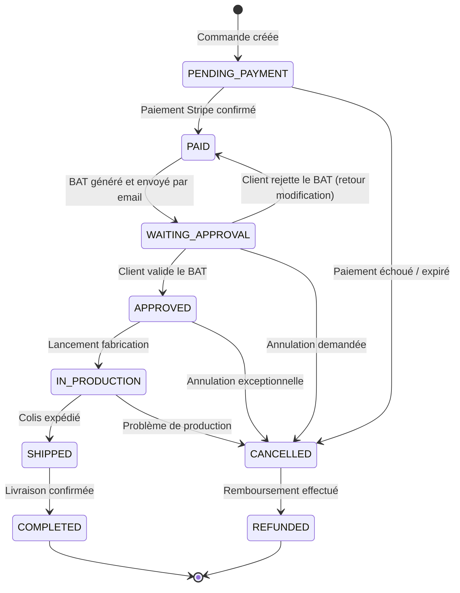
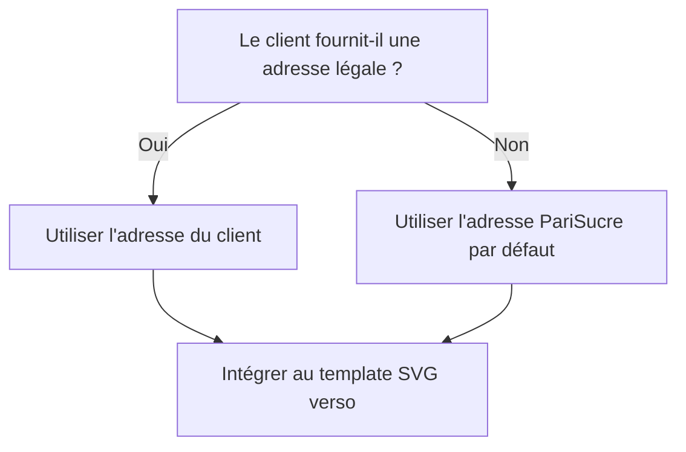
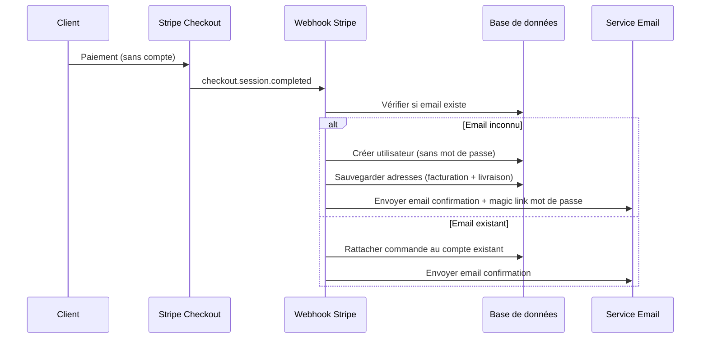
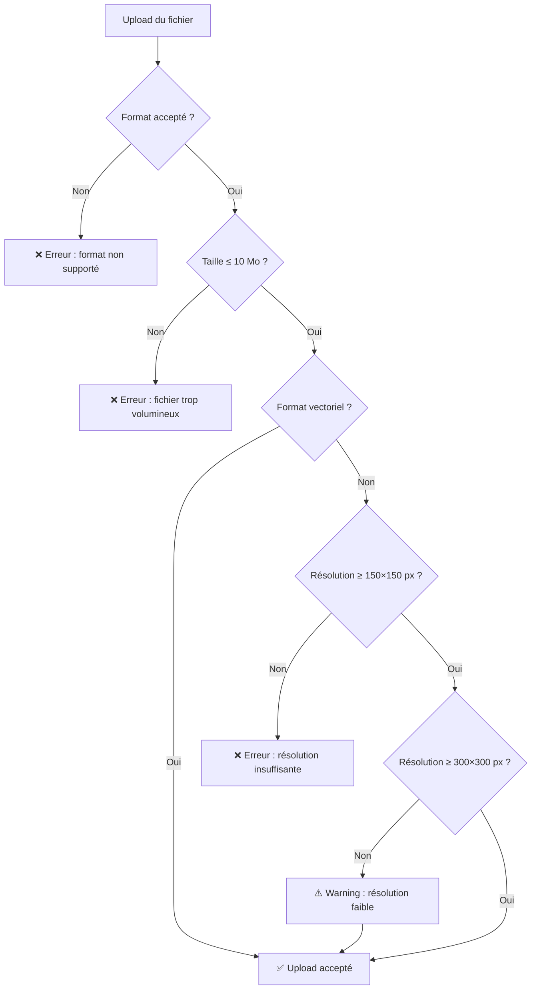

# 📋 Règles Métier — PariSucre

> Référentiel des règles métier de la plateforme de commande de bûchettes de sucre personnalisées.

---

## Table des matières

1. [Livraison](#1-livraison)
2. [Workflow BAT (Bon à Tirer)](#2-workflow-bat-bon-à-tirer)
3. [TVA](#3-tva)
4. [Pricing dégressif](#4-pricing-dégressif)
5. [Mentions légales sur le stick](#5-mentions-légales-sur-le-stick)
6. [Guest Checkout & Création de compte](#6-guest-checkout--création-de-compte)
7. [Upload du logo](#7-upload-du-logo)

---

## 1. Livraison

### Livraison gratuite — Île-de-France

La livraison est **gratuite** pour les établissements situés en Île-de-France, identifiés par le code postal du département :

| Département | Code | Livraison |
|---|---|---|
| Paris | 75 | ✅ Gratuite |
| Seine-et-Marne | 77 | ✅ Gratuite |
| Yvelines | 78 | ✅ Gratuite |
| Essonne | 91 | ✅ Gratuite |
| Hauts-de-Seine | 92 | ✅ Gratuite |
| Seine-Saint-Denis | 93 | ✅ Gratuite |
| Val-de-Marne | 94 | ✅ Gratuite |
| Val-d'Oise | 95 | ✅ Gratuite |
| Autres départements | — | 💰 Tarif à définir |

### Architecture extensible

Le système de zones de livraison est conçu pour être **extensible** :

```typescript
// Exemple de structure de configuration
interface ShippingZone {
  id: string;
  name: string;
  departments: string[];        // Codes départements couverts
  postalCodePrefixes?: string[]; // Alternative : préfixes de code postal
  shippingCost: number;         // 0 = gratuit
  freeAbove?: number;           // Seuil de gratuité (montant HT)
  estimatedDays: { min: number; max: number };
}

const SHIPPING_ZONES: ShippingZone[] = [
  {
    id: 'idf',
    name: 'Île-de-France',
    departments: ['75', '77', '78', '91', '92', '93', '94', '95'],
    shippingCost: 0,
    estimatedDays: { min: 3, max: 5 },
  },
  // Zones supplémentaires à ajouter ici
];
```

> [!NOTE]
> La détection de zone se fait par le **préfixe du code postal** renseigné dans l'adresse de livraison lors du Stripe Checkout. Stripe collecte l'adresse complète, le webhook extrait le code postal et détermine la zone applicable.

---

## 2. Workflow BAT (Bon à Tirer)

### Diagramme d'états



### Description des états

| État | Description | Déclencheur | Action système |
|---|---|---|---|
| `PENDING_PAYMENT` | Commande initiée, en attente de paiement | Clic sur « Commander » | Redirection vers Stripe Checkout |
| `PAID` | Paiement confirmé par Stripe | Webhook `checkout.session.completed` | Création compte, envoi email confirmation |
| `WAITING_APPROVAL` | BAT envoyé, en attente de validation client | Traitement post-paiement | Envoi email avec BAT PDF + magic link |
| `APPROVED` | BAT validé par le client | Clic sur « Approuver » via magic link | Notification équipe PariSucre |
| `IN_PRODUCTION` | Commande en cours de fabrication | Mise à jour manuelle (back-office) | Email client « commande en production » |
| `SHIPPED` | Colis expédié | Mise à jour manuelle + n° de suivi | Email client avec numéro de tracking |
| `COMPLETED` | Livraison effectuée | Confirmation de réception ou délai | Email de satisfaction + demande d'avis |
| `CANCELLED` | Commande annulée | Admin ou client (selon état) | Déclenchement processus de remboursement |
| `REFUNDED` | Remboursement effectué | Remboursement Stripe confirmé | Email de confirmation de remboursement |

### Règles de transition

- Un client ne peut **valider ou rejeter** le BAT que via le **magic link** reçu par email.
- Le rejet du BAT renvoie la commande à l'état `PAID` pour permettre des ajustements.
- L'annulation n'est possible que dans les états antérieurs à `SHIPPED`.
- Le remboursement est déclenché manuellement par l'admin via le back-office ou Stripe Dashboard.

---

## 3. TVA

> [!IMPORTANT]
> Le taux de TVA applicable est **à confirmer avec le client**. La classification fiscale d'un sucre en bûchette personnalisé peut être sujette à interprétation.

| Hypothèse | Taux | Justification |
|---|---|---|
| Produit alimentaire | **5,5 %** | Denrée alimentaire destinée à la consommation humaine (art. 278-0 bis CGI) |
| Produit marketing / goodies | **20 %** | Objet publicitaire personnalisé non destiné à la consommation directe |

### Implémentation

Le taux de TVA est **configurable** dans l'application :

```typescript
// Configuration TVA
interface TaxConfig {
  rate: number;       // ex: 0.055 ou 0.20
  label: string;      // "TVA 5,5 %" ou "TVA 20 %"
  legalBasis: string; // Référence légale
}

// Valeur par défaut (à confirmer)
const DEFAULT_TAX_CONFIG: TaxConfig = {
  rate: 0.20,
  label: 'TVA 20 %',
  legalBasis: 'Taux normal — Art. 278 CGI',
};
```

> [!TIP]
> Prévoir un champ `taxRate` dans la table `orders` pour **figer le taux au moment de la commande**, indépendamment d'un éventuel changement de configuration ultérieur.

---

## 4. Pricing dégressif

### Principe

Le prix unitaire de la bûchette **diminue** à mesure que la quantité commandée augmente. Ce mécanisme incite les commandes en volume.

### Paliers indicatifs

> [!WARNING]
> Les paliers ci-dessous sont **à titre indicatif**. Les prix définitifs doivent être confirmés par le client.

| Palier | Quantité | Prix unitaire HT | Prix carton (500) HT | Économie vs. palier 1 |
|---|---|---|---|---|
| 1 | 1 000 – 2 499 | 0,12 € | 60,00 € | — |
| 2 | 2 500 – 4 999 | 0,10 € | 50,00 € | -17 % |
| 3 | 5 000 – 9 999 | 0,08 € | 40,00 € | -33 % |
| 4 | 10 000+ | 0,06 € | 30,00 € | -50 % |

### Conditionnement

- **Unité de vente** : le carton
- **Carton standard** : 500 ou 1 000 bûchettes (à confirmer)
- La quantité commandée doit être un **multiple du conditionnement**
- Le sélecteur de quantité dans le configurateur propose des paliers prédéfinis

### Calcul du prix

```typescript
interface PricingTier {
  minQuantity: number;
  maxQuantity: number | null; // null = illimité
  unitPriceHT: number;
}

function calculatePrice(quantity: number, tiers: PricingTier[]): number {
  const tier = tiers.find(
    (t) => quantity >= t.minQuantity && (t.maxQuantity === null || quantity <= t.maxQuantity)
  );
  if (!tier) throw new Error('Quantité invalide');
  return quantity * tier.unitPriceHT;
}
```

---

## 5. Mentions légales sur le stick

Chaque bûchette de sucre personnalisée doit comporter des **mentions légales obligatoires** :

### Éléments obligatoires

| Élément | Description | Emplacement |
|---|---|---|
| **Pictogrammes réglementaires** | Pictogrammes obligatoires liés à l'emballage alimentaire (Triman, Point Vert, etc.) | Verso du stick |
| **Poids net** | Poids en grammes du contenu (ex : « 5 g ») | Verso du stick |
| **Adresse du conditionneur** | Adresse de l'établissement client (si personnalisation complète) ou adresse PariSucre (par défaut) | Verso du stick |
| **Dénomination** | « Sucre blanc » ou « Sucre roux » selon le produit | Verso du stick |

### Logique d'adresse



> [!NOTE]
> L'adresse PariSucre par défaut est utilisée lorsque le client ne souhaite pas que l'adresse de son établissement figure sur la bûchette. Ce champ est optionnel dans le configurateur.

---

## 6. Guest Checkout & Création de compte

### Principe

Aucun compte n'est requis pour passer commande. L'objectif est de **minimiser la friction** dans le tunnel de conversion.

### Flux de création de compte



### Règles

- Le **Stripe Checkout** collecte : email, nom, adresse de facturation, adresse de livraison, numéro SIRET.
- Le compte est créé **automatiquement** après paiement réussi via le webhook.
- L'utilisateur est créé **sans mot de passe** — il reçoit un **magic link** pour définir son mot de passe ultérieurement.
- Si l'email correspond à un compte existant, la commande est rattachée à ce compte.
- Le SIRET est stocké comme métadonnée Stripe et enregistré dans le profil utilisateur.

---

## 7. Upload du logo

### Formats acceptés

| Format | Type MIME | Remarque |
|---|---|---|
| SVG | `image/svg+xml` | ✅ Recommandé — vectoriel, qualité optimale |
| PDF | `application/pdf` | ✅ Recommandé — souvent vectoriel |
| PNG | `image/png` | ⚠️ Vérifier la résolution |
| JPG / JPEG | `image/jpeg` | ⚠️ Vérifier la résolution |
| WEBP | `image/webp` | ⚠️ Vérifier la résolution |

### Contraintes

| Contrainte | Valeur | Comportement |
|---|---|---|
| **Taille maximale** | 10 Mo | ❌ Bloquant — le fichier est refusé |
| **Résolution minimale (warning)** | 300 × 300 px | ⚠️ Avertissement non bloquant — « Résolution faible, le rendu final pourrait être pixelisé » |
| **Résolution minimale (bloquant)** | 150 × 150 px | ❌ Bloquant — le fichier est refusé avec message explicatif |
| **Formats vectoriels** | SVG, PDF | Pas de vérification de résolution (vectoriel = résolution infinie) |

### Flux de validation



### Stockage

- Les logos uploadés sont stockés sur **Vercel Blob**.
- Chaque fichier reçoit un identifiant unique (UUID) pour éviter les collisions.
- Les métadonnées (nom original, taille, dimensions, type MIME) sont enregistrées en base de données.
- Les logos sont conservés **indéfiniment** (pas de politique de suppression automatique en V1).
