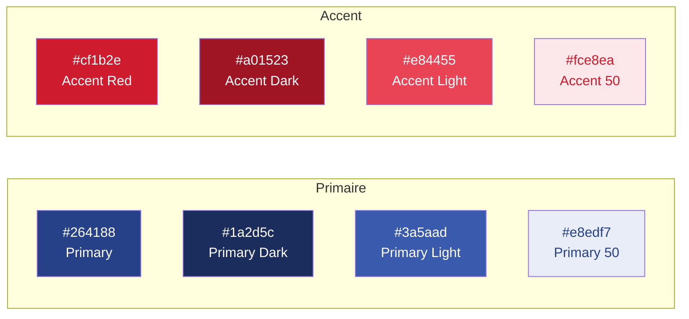

# 🎨 Design System — PariSucre

> Référentiel visuel et directives de design de la plateforme PariSucre.

---

## Table des matières

1. [Principes de design](#1-principes-de-design)
2. [Palette de couleurs](#2-palette-de-couleurs)
3. [Typographie](#3-typographie)
4. [Échelle d'espacement](#4-échelle-despacement)
5. [Arrondis et ombres](#5-arrondis-et-ombres)
6. [Configuration Tailwind](#6-configuration-tailwind)
7. [Composants shadcn/ui](#7-composants-shadcnui)
8. [Patterns UI récurrents](#8-patterns-ui-récurrents)

---

## 1. Principes de design

Le design de PariSucre s'inspire du **packaging alimentaire haut de gamme** et du design **B2B premium**. Chaque décision visuelle doit renforcer la crédibilité, la confiance et le professionnalisme de la marque.

### Mots-clés directeurs

| Principe | Description |
|---|---|
| **Sobre** | Pas de surcharge visuelle, chaque élément a une raison d'être |
| **Épuré** | Interfaces aérées, beaucoup d'espace blanc, hiérarchie claire |
| **Premium** | Typographie soignée, couleurs profondes, attention aux détails |
| **Professionnel** | Adapté à une audience B2B (gérants CHR), ton sérieux mais accessible |

### Directives visuelles

- **Fond blanc dominant** — le contenu respire, les visuels de bûchettes ressortent
- **Espaces aérés** — marges généreuses entre les sections (80px+ en desktop)
- **Couleurs profondes** — le bleu primaire et le rouge d'accentuation sont utilisés avec parcimonie
- **Contrastes forts** — texte sombre sur fond clair, CTA colorés sur fond neutre
- **Micro-interactions** — animations subtiles au hover et au scroll (pas de mouvements brusques)

---

## 2. Palette de couleurs

### Couleurs principales



#### Bleu primaire — Confiance & professionnalisme

| Token | Hex | Utilisation |
|---|---|---|
| `primary-900` | `#0f1a36` | Texte sur fond clair très sombre |
| `primary-800` | `#1a2d5c` | Headers, fond footer, hover states |
| `primary-700` | `#264188` | **Couleur principale** — CTA, liens, icônes actives |
| `primary-600` | `#2f4f9e` | Hover des CTA principaux |
| `primary-500` | `#3a5aad` | Liens secondaires, bordures actives |
| `primary-400` | `#6b84c7` | Icônes inactives, texte secondaire |
| `primary-300` | `#9baede` | Bordures légères, séparateurs |
| `primary-200` | `#c4d0ee` | Fond de badges, tags |
| `primary-100` | `#dfe5f5` | Fond de sections alternées |
| `primary-50` | `#e8edf7` | Fond de cartes, hover subtil |

#### Rouge d'accentuation — Énergie & urgence

| Token | Hex | Utilisation |
|---|---|---|
| `accent-900` | `#5a0b14` | Texte d'erreur sombre |
| `accent-800` | `#a01523` | Hover des CTA d'accentuation |
| `accent-700` | `#cf1b2e` | **Couleur d'accent** — CTA secondaires, badges promo, alertes |
| `accent-600` | `#d93d4d` | Hover léger |
| `accent-500` | `#e84455` | Indicateurs, notifications |
| `accent-400` | `#f07a86` | Bordures d'alerte |
| `accent-300` | `#f5a3ac` | Fond d'alertes légères |
| `accent-200` | `#f9c9cf` | Badges d'erreur légers |
| `accent-100` | `#fce8ea` | Fond d'erreur très léger |
| `accent-50` | `#fef2f3` | Fond de notification subtle |

### Palette neutre

| Token | Hex | Utilisation |
|---|---|---|
| `white` | `#FFFFFF` | Fond principal de la page |
| `gray-50` | `#F9FAFB` | Fond de sections alternées |
| `gray-100` | `#F3F4F6` | Fond de cartes, inputs |
| `gray-200` | `#E5E7EB` | Bordures, séparateurs |
| `gray-300` | `#D1D5DB` | Bordures de formulaires |
| `gray-400` | `#9CA3AF` | Texte placeholder |
| `gray-500` | `#6B7280` | Texte secondaire, captions |
| `gray-600` | `#4B5563` | Texte de corps |
| `gray-700` | `#374151` | Texte de corps renforcé |
| `gray-800` | `#1F2937` | Titres, texte principal |
| `gray-900` | `#111827` | Titres importants, texte sur fond clair |

### Couleurs sémantiques

| Token | Hex | Utilisation |
|---|---|---|
| `success` | `#16A34A` | Validation, confirmation, badges de succès |
| `warning` | `#F59E0B` | Avertissements (résolution logo faible) |
| `error` | `#DC2626` | Erreurs de formulaire, rejets |
| `info` | `#2563EB` | Informations, tooltips |

---

## 3. Typographie

### Polices

| Police | Catégorie | Utilisation | Caractère |
|---|---|---|---|
| **Playfair Display** | Serif (display) | Titres, headings, éléments de marque | Élégant, premium, classique |
| **Inter** | Sans-serif (body) | Corps de texte, UI, labels, boutons | Lisible, moderne, professionnel |

### Chargement des polices

```typescript
// app/layout.tsx
import { Playfair_Display, Inter } from 'next/font/google';

const playfair = Playfair_Display({
  subsets: ['latin'],
  variable: '--font-playfair',
  display: 'swap',
});

const inter = Inter({
  subsets: ['latin'],
  variable: '--font-inter',
  display: 'swap',
});

export default function RootLayout({ children }: { children: React.ReactNode }) {
  return (
    <html lang="fr" className={`${playfair.variable} ${inter.variable}`}>
      <body className="font-sans antialiased">{children}</body>
    </html>
  );
}
```

### Échelle typographique

| Token | Taille | Line Height | Lettre | Police | Utilisation |
|---|---|---|---|---|---|
| `display-xl` | 4rem (64px) | 1.1 | -0.02em | Playfair Display Bold | Hero title |
| `display-lg` | 3rem (48px) | 1.15 | -0.02em | Playfair Display Bold | Section titles |
| `display-md` | 2.25rem (36px) | 1.2 | -0.01em | Playfair Display SemiBold | Sous-titres principaux |
| `heading-lg` | 1.875rem (30px) | 1.3 | -0.01em | Playfair Display SemiBold | Card headings |
| `heading-md` | 1.5rem (24px) | 1.35 | 0 | Inter SemiBold | Section sub-headings |
| `heading-sm` | 1.25rem (20px) | 1.4 | 0 | Inter SemiBold | Labels importants |
| `body-lg` | 1.125rem (18px) | 1.6 | 0 | Inter Regular | Texte de lecture |
| `body-md` | 1rem (16px) | 1.6 | 0 | Inter Regular | Texte courant |
| `body-sm` | 0.875rem (14px) | 1.5 | 0 | Inter Regular | Texte secondaire, captions |
| `caption` | 0.75rem (12px) | 1.5 | 0.01em | Inter Medium | Labels, badges, meta |

### Règles typographiques

- Les **titres** utilisent exclusivement `Playfair Display` pour marquer le positionnement premium.
- Le **corps de texte** et les éléments d'interface utilisent `Inter` pour une lisibilité optimale.
- Les **CTA (boutons)** utilisent `Inter` en `font-medium` ou `font-semibold`.
- Les **montants et prix** utilisent `Inter` en `font-bold` avec une taille légèrement supérieure.
- Les **nombres** utilisent la variante `tabular-nums` d'Inter pour un alignement parfait dans les tableaux.

---

## 4. Échelle d'espacement

L'espacement suit une **échelle de 4px** cohérente avec les tokens Tailwind CSS par défaut :

| Token | Valeur | Utilisation |
|---|---|---|
| `0.5` | 2px | Micro-espacements (entre icône et label) |
| `1` | 4px | Padding interne très compact |
| `1.5` | 6px | Gap entre badges |
| `2` | 8px | Padding boutons petits, gaps de grille compacts |
| `3` | 12px | Padding interne de badges, chips |
| `4` | 16px | Padding de cartes, gap standard de grille |
| `5` | 20px | Padding horizontal de boutons |
| `6` | 24px | Marges entre éléments de formulaire |
| `8` | 32px | Padding de sections internes |
| `10` | 40px | Espacement entre blocs de contenu |
| `12` | 48px | Marges entre composants majeurs |
| `16` | 64px | Padding vertical de sections (mobile) |
| `20` | 80px | Padding vertical de sections (desktop) |
| `24` | 96px | Marge entre sections majeures (desktop) |

### Conteneur principal

```css
/* Container max widths */
.container {
  max-width: 1280px;   /* xl */
  margin: 0 auto;
  padding: 0 1rem;     /* mobile */
}

@media (min-width: 640px) {
  .container { padding: 0 1.5rem; }
}

@media (min-width: 1024px) {
  .container { padding: 0 2rem; }
}
```

---

## 5. Arrondis et ombres

### Border Radius

| Token | Valeur | Utilisation |
|---|---|---|
| `radius-sm` | 4px | Badges, chips, tags |
| `radius-md` | 8px | Boutons, inputs, tooltips |
| `radius-lg` | 12px | Cartes, modals, dropdowns |
| `radius-xl` | 16px | Cartes principales, sections mises en avant |
| `radius-2xl` | 24px | Images hero, conteneurs d'illustration |
| `radius-full` | 9999px | Avatars, pastilles de couleur, toggles |

### Ombres

| Token | Valeur | Utilisation |
|---|---|---|
| `shadow-sm` | `0 1px 2px rgba(0, 0, 0, 0.05)` | Boutons au repos, inputs |
| `shadow-md` | `0 4px 6px -1px rgba(0, 0, 0, 0.07), 0 2px 4px -2px rgba(0, 0, 0, 0.05)` | Cartes, dropdowns |
| `shadow-lg` | `0 10px 15px -3px rgba(0, 0, 0, 0.08), 0 4px 6px -4px rgba(0, 0, 0, 0.04)` | Modals, cartes en hover |
| `shadow-xl` | `0 20px 25px -5px rgba(0, 0, 0, 0.08), 0 8px 10px -6px rgba(0, 0, 0, 0.04)` | Éléments flottants, popovers |
| `shadow-inner` | `inset 0 2px 4px rgba(0, 0, 0, 0.05)` | Inputs focus, zones de drop |

> [!TIP]
> Les ombres sont volontairement **subtiles** (faible opacité) pour renforcer l'aspect épuré et premium. Éviter les ombres lourdes qui alourdissent visuellement l'interface.

---

## 6. Configuration Tailwind

### `tailwind.config.ts`

```typescript
import type { Config } from 'tailwindcss';

const config: Config = {
  darkMode: 'class',
  content: [
    './src/**/*.{ts,tsx}',
    './components/**/*.{ts,tsx}',
  ],
  theme: {
    extend: {
      // ─── Couleurs ──────────────────────────────────
      colors: {
        primary: {
          50: '#e8edf7',
          100: '#dfe5f5',
          200: '#c4d0ee',
          300: '#9baede',
          400: '#6b84c7',
          500: '#3a5aad',
          600: '#2f4f9e',
          700: '#264188',  // DEFAULT
          800: '#1a2d5c',
          900: '#0f1a36',
          DEFAULT: '#264188',
        },
        accent: {
          50: '#fef2f3',
          100: '#fce8ea',
          200: '#f9c9cf',
          300: '#f5a3ac',
          400: '#f07a86',
          500: '#e84455',
          600: '#d93d4d',
          700: '#cf1b2e',  // DEFAULT
          800: '#a01523',
          900: '#5a0b14',
          DEFAULT: '#cf1b2e',
        },
        success: '#16A34A',
        warning: '#F59E0B',
        error: '#DC2626',
        info: '#2563EB',
      },

      // ─── Typographie ──────────────────────────────
      fontFamily: {
        sans: ['var(--font-inter)', 'system-ui', 'sans-serif'],
        display: ['var(--font-playfair)', 'Georgia', 'serif'],
      },
      fontSize: {
        'display-xl': ['4rem', { lineHeight: '1.1', letterSpacing: '-0.02em' }],
        'display-lg': ['3rem', { lineHeight: '1.15', letterSpacing: '-0.02em' }],
        'display-md': ['2.25rem', { lineHeight: '1.2', letterSpacing: '-0.01em' }],
        'heading-lg': ['1.875rem', { lineHeight: '1.3', letterSpacing: '-0.01em' }],
        'heading-md': ['1.5rem', { lineHeight: '1.35' }],
        'heading-sm': ['1.25rem', { lineHeight: '1.4' }],
        'body-lg': ['1.125rem', { lineHeight: '1.6' }],
        'body-md': ['1rem', { lineHeight: '1.6' }],
        'body-sm': ['0.875rem', { lineHeight: '1.5' }],
        caption: ['0.75rem', { lineHeight: '1.5', letterSpacing: '0.01em' }],
      },

      // ─── Arrondis ─────────────────────────────────
      borderRadius: {
        sm: '4px',
        md: '8px',
        lg: '12px',
        xl: '16px',
        '2xl': '24px',
      },

      // ─── Ombres ───────────────────────────────────
      boxShadow: {
        sm: '0 1px 2px rgba(0, 0, 0, 0.05)',
        md: '0 4px 6px -1px rgba(0, 0, 0, 0.07), 0 2px 4px -2px rgba(0, 0, 0, 0.05)',
        lg: '0 10px 15px -3px rgba(0, 0, 0, 0.08), 0 4px 6px -4px rgba(0, 0, 0, 0.04)',
        xl: '0 20px 25px -5px rgba(0, 0, 0, 0.08), 0 8px 10px -6px rgba(0, 0, 0, 0.04)',
        inner: 'inset 0 2px 4px rgba(0, 0, 0, 0.05)',
      },

      // ─── Espacement sections ──────────────────────
      spacing: {
        section: '5rem',        // 80px — padding section desktop
        'section-sm': '4rem',   // 64px — padding section mobile
      },

      // ─── Animations ──────────────────────────────
      keyframes: {
        'fade-in': {
          from: { opacity: '0', transform: 'translateY(8px)' },
          to: { opacity: '1', transform: 'translateY(0)' },
        },
        'slide-up': {
          from: { opacity: '0', transform: 'translateY(16px)' },
          to: { opacity: '1', transform: 'translateY(0)' },
        },
      },
      animation: {
        'fade-in': 'fade-in 0.3s ease-out',
        'slide-up': 'slide-up 0.4s ease-out',
      },
    },
  },
  plugins: [require('tailwindcss-animate')],
};

export default config;
```

### Variables CSS globales

```css
/* globals.css */
@tailwind base;
@tailwind components;
@tailwind utilities;

@layer base {
  :root {
    /* Couleurs HSL pour shadcn/ui */
    --background: 0 0% 100%;
    --foreground: 222 47% 11%;

    --primary: 222 55% 34%;          /* #264188 */
    --primary-foreground: 0 0% 100%;

    --secondary: 220 14% 96%;
    --secondary-foreground: 222 47% 11%;

    --accent: 354 78% 46%;           /* #cf1b2e */
    --accent-foreground: 0 0% 100%;

    --muted: 220 14% 96%;
    --muted-foreground: 220 9% 46%;

    --destructive: 0 84% 60%;
    --destructive-foreground: 0 0% 100%;

    --border: 220 13% 91%;
    --input: 220 13% 91%;
    --ring: 222 55% 34%;

    --radius: 0.5rem;

    /* Typographie */
    --font-playfair: 'Playfair Display', Georgia, serif;
    --font-inter: 'Inter', system-ui, sans-serif;
  }
}
```

---

## 7. Composants shadcn/ui

### Personnalisations appliquées

Les composants shadcn/ui sont installés et personnalisés pour respecter l'identité PariSucre :

#### Boutons

| Variante | Apparence | Utilisation |
|---|---|---|
| `default` | Fond `primary-700`, texte blanc | CTA principal (« Commander ») |
| `secondary` | Fond `gray-100`, texte `gray-800` | Actions secondaires |
| `accent` | Fond `accent-700`, texte blanc | Promotions, mise en avant |
| `outline` | Bordure `primary-300`, texte `primary-700` | Actions tertiaires |
| `ghost` | Transparent, texte `gray-600` | Navigation, actions discrètes |
| `link` | Texte `primary-700`, souligné au hover | Liens textuels |

```typescript
// Exemple de variante personnalisée
const buttonVariants = cva(
  'inline-flex items-center justify-center rounded-md text-sm font-medium transition-colors focus-visible:outline-none focus-visible:ring-2 focus-visible:ring-ring disabled:pointer-events-none disabled:opacity-50',
  {
    variants: {
      variant: {
        default: 'bg-primary-700 text-white hover:bg-primary-800 shadow-sm',
        accent: 'bg-accent-700 text-white hover:bg-accent-800 shadow-sm',
        secondary: 'bg-gray-100 text-gray-800 hover:bg-gray-200',
        outline: 'border border-primary-300 text-primary-700 hover:bg-primary-50',
        ghost: 'text-gray-600 hover:bg-gray-100 hover:text-gray-800',
        link: 'text-primary-700 underline-offset-4 hover:underline',
      },
      size: {
        sm: 'h-9 px-3 text-body-sm',
        md: 'h-11 px-5 text-body-md',
        lg: 'h-13 px-8 text-body-lg font-semibold',
        icon: 'h-10 w-10',
      },
    },
    defaultVariants: {
      variant: 'default',
      size: 'md',
    },
  }
);
```

#### Inputs

| Personnalisation | Valeur |
|---|---|
| Border radius | `radius-md` (8px) |
| Border color | `gray-300` → `primary-500` au focus |
| Background | `white` (pas de fond gris) |
| Height | `h-11` (44px) pour respecter les standards tactiles |
| Focus ring | `ring-primary-500` avec offset de 2px |

#### Cartes

| Personnalisation | Valeur |
|---|---|
| Border radius | `radius-lg` (12px) |
| Border | `1px solid gray-200` |
| Shadow | `shadow-sm` au repos → `shadow-md` au hover |
| Padding | `p-6` (24px) |
| Transition | `transition-shadow duration-200` |

---

## 8. Patterns UI récurrents

### Barre de progression du configurateur

```
  ● Upload    ● Couleurs    ● Textes    ● Template    ● Quantité    ○ Résumé
  ━━━━━━━━━━━━━━━━━━━━━━━━━━━━━━━━━━━━━━━━━━━━━━━━━━━━━━━━━━━━━━━━━──────────
  ←────────────── Étapes complétées (primary-700) ──────────────→  ← À venir →
```

- Étapes complétées : cercle plein + barre en `primary-700`
- Étape active : cercle plein + animation pulse subtile
- Étapes futures : cercle vide + barre en `gray-200`

### Cards de templates

```
  ┌─────────────────────────────┐
  │                             │
  │   [Preview SVG du template] │
  │                             │
  ├─────────────────────────────┤
  │  ✨ Élégant                 │
  │  Fond sombre, filet doré    │
  └─────────────────────────────┘
       ↓ sélectionné ↓
  ┌─────────────────────────────┐  ← border: 2px primary-700
  │  ✓                          │  ← badge check en haut à droite
  │   [Preview SVG du template] │
  │                             │
  ├─────────────────────────────┤
  │  ✨ Élégant                 │     bg: primary-50
  │  Fond sombre, filet doré    │
  └─────────────────────────────┘
```

### Zone de pricing

- Palier actuel surligné en `primary-50` avec bordure `primary-700`
- Badge « -33 % » en `accent-700` sur fond `accent-50`
- Badge « Meilleur rapport qualité-prix » en `success` sur le palier recommandé
- Prix barré (palier 1) + prix effectif en gras pour visualiser l'économie

### Zone de drag & drop

```
  ┌ ─ ─ ─ ─ ─ ─ ─ ─ ─ ─ ─ ─ ─ ─ ─ ─ ─ ─ ┐
  │                                          │  ← border: 2px dashed gray-300
  │         📤 Glissez votre logo ici        │     bg: gray-50
  │            ou cliquez pour parcourir      │     hover: border-primary-500
  │                                          │     drag-over: bg-primary-50,
  │         SVG, PDF, PNG, JPG — max 10 Mo   │               border-primary-700
  └ ─ ─ ─ ─ ─ ─ ─ ─ ─ ─ ─ ─ ─ ─ ─ ─ ─ ─ ┘
```

### Palette de couleurs interactive

```
  Couleurs extraites de votre logo :

  ● ● ● ● ● ●
  ↑
  Couleur sélectionnée → ColorPicker s'ouvre en dessous

  [Réinitialiser les couleurs]   ← bouton ghost
```

- Chaque pastille est un cercle de 40px avec `radius-full`
- Pastille sélectionnée : `ring-2 ring-primary-700 ring-offset-2`
- Au clic : ouverture d'un ColorPicker inline (pas de modal)

---

## Annexe — Checklist accessibilité

| Critère | Standard | Statut |
|---|---|---|
| Contraste texte/fond | WCAG AA (4.5:1) | ✅ Respecté pour tous les tokens |
| Taille minimale cible tactile | 44×44 px | ✅ Boutons et inputs h-11 |
| Focus visible | Anneau de focus 2px | ✅ ring-2 ring-primary-500 |
| Texte alternatif images | Attribut alt obligatoire | ✅ Convention de nommage |
| Navigation clavier | Tab order logique | ✅ Structure sémantique HTML |
| Rôles ARIA | Composants Radix UI | ✅ Intégré via shadcn/ui |
