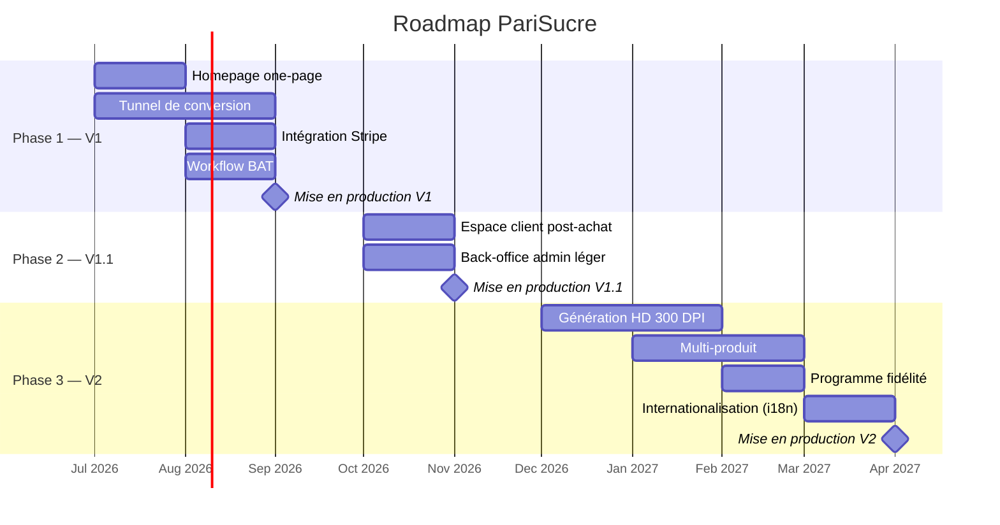

# 🗺️ Roadmap Produit — PariSucre

> **Plateforme B2B de commande de bûchettes de sucre personnalisées pour le marché CHR**
> *(Cafés, Hôtels, Restaurants)*

---

## Vision

PariSucre permet aux professionnels du secteur CHR de commander en ligne des bûchettes de sucre personnalisées à l'image de leur établissement. L'expérience est pensée comme un **tunnel de conversion fluide en une seule page** : le client téléverse son logo, choisit un template, prévisualise le résultat en temps réel et passe commande — le tout sans créer de compte au préalable.

---

## Phases de développement

---

### Phase 1 — V1 : Tunnel de conversion (MVP)

**Objectif** : Permettre à un professionnel CHR de commander des bûchettes personnalisées en moins de 10 minutes, sans friction.

| Fonctionnalité | Description |
|---|---|
| **Homepage one-page** | Page d'atterrissage unique avec hero section, proposition de valeur, configurateur intégré, pricing et CTA |
| **Upload logo** | Drag & drop du logo de l'établissement (SVG, PDF, PNG, JPG, WEBP) |
| **Analyse couleurs** | Extraction automatique de la palette de couleurs dominantes du logo côté client |
| **Choix template** | Sélection parmi 4 templates de bûchettes prédéfinis |
| **Preview SVG** | Prévisualisation en temps réel du rendu de la bûchette personnalisée |
| **Pricing dégressif** | Affichage du prix unitaire décroissant par palier de quantité avec économies mises en avant |
| **Stripe Checkout** | Paiement sécurisé en mode invité (guest checkout), collecte adresse + SIRET |
| **Workflow BAT** | Envoi du bon à tirer numérique par email, validation par le client via magic link |
| **Création de compte auto** | Compte créé automatiquement après paiement via webhook Stripe |

**Livrables clés** :
- Landing page responsive et performante (PWA)
- Configurateur interactif complet
- Intégration paiement Stripe
- Emails transactionnels (confirmation, BAT, tracking)

---

### Phase 2 — V1.1 : Espace client & Back-office

**Objectif** : Offrir un suivi post-achat au client et des outils de gestion à l'équipe PariSucre.

| Fonctionnalité | Description |
|---|---|
| **Espace client** | Historique des commandes, re-commande simplifiée, gestion du profil et des adresses |
| **Tableau de bord client** | Suivi du statut des commandes en cours (BAT, production, expédition) |
| **Back-office admin léger** | Gestion des commandes, mise à jour des statuts, visualisation des BAT |
| **Gestion des utilisateurs** | Liste des clients, détails des commandes associées |
| **Notifications admin** | Alertes email pour nouvelles commandes et validations BAT |

---

### Phase 3 — V2 : Montée en gamme

**Objectif** : Automatiser la production, élargir le catalogue et conquérir de nouveaux marchés.

| Fonctionnalité | Description |
|---|---|
| **Génération HD 300 DPI** | Export automatique des fichiers d'impression haute définition (remplacement du workflow BAT manuel) |
| **Multi-produit** | Extension du catalogue : sachets de sucre, touillettes, serviettes, sets de table personnalisés |
| **Programme fidélité** | Points de fidélité, remises récurrentes, paliers VIP pour les clients réguliers |
| **Internationalisation (i18n)** | Support multilingue (FR, EN, ES, DE) pour l'expansion européenne |
| **API partenaires** | API REST pour intégration avec les systèmes de commande des distributeurs |

---

## ⚠️ Pricing à revoir avec le client

> [!WARNING]
> Les éléments suivants nécessitent une **validation client** avant implémentation définitive :

| Élément | Question ouverte | Impact |
|---|---|---|
| **Paliers de prix** | Quels sont les seuils exacts de quantité et les prix unitaires associés ? | Composant `PricingTable`, calcul panier |
| **Taux de TVA** | 20 % (taux normal) ou 5,5 % (produit alimentaire) ? Le sucre personnalisé est-il considéré comme denrée alimentaire ou produit marketing ? | Calcul du prix TTC, mentions sur facture |
| **Unités de conditionnement** | Cartons de 500 ou 1 000 bûchettes ? Possibilité de mixer ? | Logique de calcul quantité, UX sélecteur |
| **Quantité minimale** | Quel est le minimum de commande ? (ex : 1 000, 2 000, 5 000 bûchettes) | Validation formulaire, pricing |
| **Frais de livraison hors IDF** | Grille tarifaire pour les livraisons en dehors de l'Île-de-France ? | Module de calcul frais de port |

---

## Indicateurs de succès (KPIs)

| Phase | KPI | Objectif |
|---|---|---|
| V1 | Taux de conversion visiteur → commande | > 3 % |
| V1 | Temps moyen du tunnel de commande | < 10 min |
| V1.1 | Taux de re-commande | > 30 % |
| V2 | Nombre de produits commandés par client | > 1,5 |
| V2 | Part du CA international | > 10 % |
