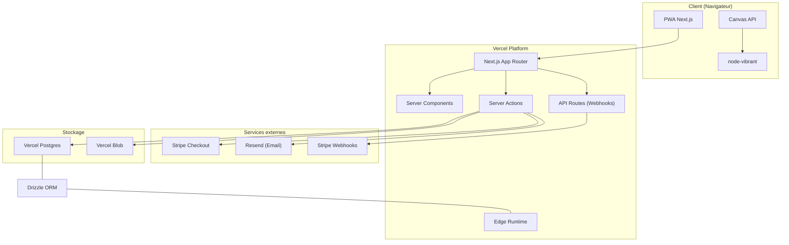
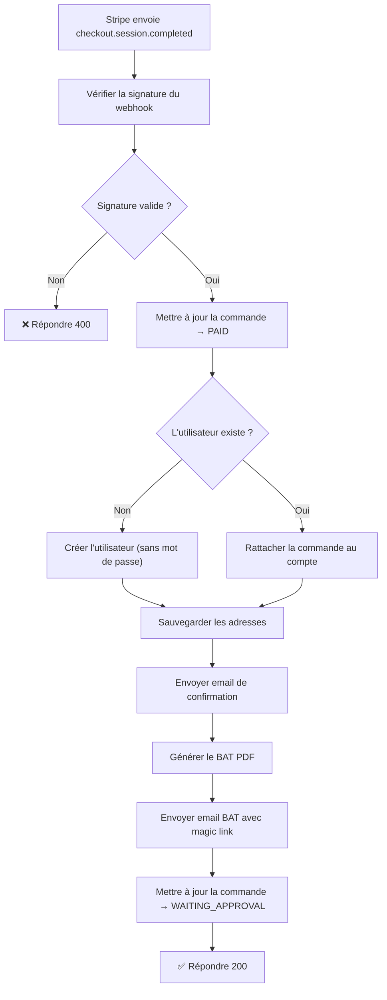
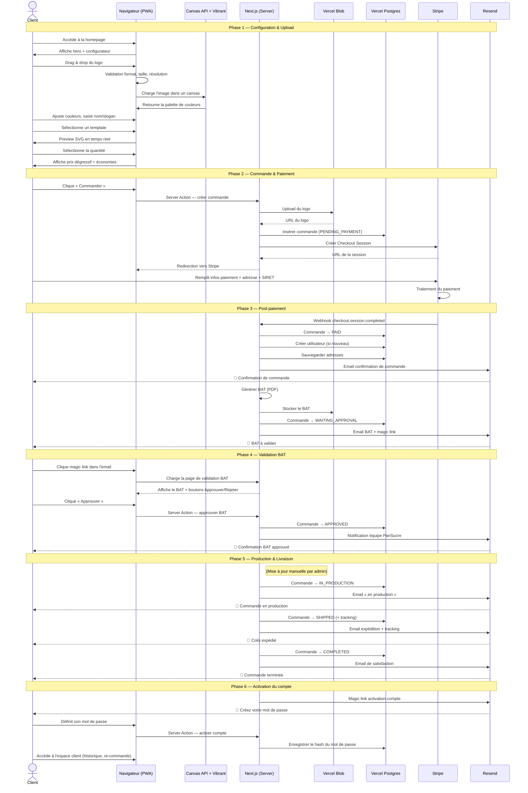

# 🏗️ Architecture Technique — PariSucre

> Documentation de l'architecture technique de la plateforme PariSucre.

---

## Table des matières

1. [Vue d'ensemble](#1-vue-densemble)
2. [Stack technique](#2-stack-technique)
3. [Base de données](#3-base-de-données)
4. [Stockage fichiers](#4-stockage-fichiers)
5. [Paiements](#5-paiements)
6. [Emails transactionnels](#6-emails-transactionnels)
7. [Extraction des couleurs](#7-extraction-des-couleurs)
8. [Templates SVG](#8-templates-svg)
9. [Hooks personnalisés](#9-hooks-personnalisés)
10. [Flux complet — Diagramme de séquence](#10-flux-complet--diagramme-de-séquence)

---

## 1. Vue d'ensemble



---

## 2. Stack technique

### Framework & Langage

| Technologie | Version | Rôle |
|---|---|---|
| **Next.js** | 15+ | Framework React fullstack (App Router) |
| **TypeScript** | 5+ (strict mode) | Langage principal — typage strict activé |
| **React** | 19+ | Bibliothèque UI (Server Components + Client Components) |

### Configuration TypeScript

```json
{
  "compilerOptions": {
    "strict": true,
    "noUncheckedIndexedAccess": true,
    "exactOptionalPropertyTypes": true,
    "forceConsistentCasingInFileNames": true
  }
}
```

### UI & Styles

| Technologie | Rôle |
|---|---|
| **Tailwind CSS** | Framework CSS utility-first |
| **shadcn/ui** | Composants UI accessibles et personnalisables (basés sur Radix UI) |
| **Lucide React** | Bibliothèque d'icônes |
| **Framer Motion** | Animations et transitions |

### Choix de l'App Router

Le projet utilise exclusivement l'**App Router** de Next.js 15+ :

- **Server Components** par défaut pour les pages et layouts → réduction du bundle JS client
- **Server Actions** pour les mutations (upload, commandes) → typage end-to-end, pas d'API REST à maintenir
- **API Routes** uniquement pour les webhooks Stripe (nécessitent un endpoint HTTP brut)
- **Streaming & Suspense** pour un chargement progressif de l'interface

---

## 3. Base de données

### Vercel Postgres + Drizzle ORM

| Critère | Drizzle ORM | Prisma |
|---|---|---|
| Compatibilité Edge Runtime | ✅ Natif | ❌ Nécessite un Data Proxy |
| Taille du bundle | ~50 Ko | ~2 Mo+ |
| Requêtes SQL typées | ✅ SQL-like, proche du métal | ✅ API fluide mais abstraite |
| Migrations | ✅ `drizzle-kit` | ✅ `prisma migrate` |
| Relations | ✅ Relations explicites | ✅ Relations implicites |

> [!TIP]
> Drizzle a été choisi plutôt que Prisma pour sa **compatibilité native avec l'Edge Runtime** de Vercel et son **bundle significativement plus léger**, crucial pour les performances des Server Actions.

### Schéma principal

```typescript
// schema.ts — Extrait des tables principales
import { pgTable, uuid, varchar, text, integer, numeric, timestamp, pgEnum } from 'drizzle-orm/pg-core';

export const orderStatusEnum = pgEnum('order_status', [
  'PENDING_PAYMENT',
  'PAID',
  'WAITING_APPROVAL',
  'APPROVED',
  'IN_PRODUCTION',
  'SHIPPED',
  'COMPLETED',
  'CANCELLED',
  'REFUNDED',
]);

export const users = pgTable('users', {
  id: uuid('id').primaryKey().defaultRandom(),
  email: varchar('email', { length: 255 }).notNull().unique(),
  name: varchar('name', { length: 255 }),
  passwordHash: text('password_hash'),          // null = compte non activé
  siret: varchar('siret', { length: 14 }),
  stripeCustomerId: varchar('stripe_customer_id', { length: 255 }),
  createdAt: timestamp('created_at').defaultNow().notNull(),
  updatedAt: timestamp('updated_at').defaultNow().notNull(),
});

export const orders = pgTable('orders', {
  id: uuid('id').primaryKey().defaultRandom(),
  userId: uuid('user_id').references(() => users.id),
  status: orderStatusEnum('status').default('PENDING_PAYMENT').notNull(),
  quantity: integer('quantity').notNull(),
  unitPriceHT: numeric('unit_price_ht', { precision: 10, scale: 4 }).notNull(),
  totalHT: numeric('total_ht', { precision: 10, scale: 2 }).notNull(),
  taxRate: numeric('tax_rate', { precision: 5, scale: 4 }).notNull(),
  totalTTC: numeric('total_ttc', { precision: 10, scale: 2 }).notNull(),
  shippingCost: numeric('shipping_cost', { precision: 10, scale: 2 }).default('0').notNull(),
  templateId: varchar('template_id', { length: 50 }).notNull(),
  logoUrl: text('logo_url').notNull(),
  colors: text('colors').notNull(),               // JSON stringified
  establishmentName: varchar('establishment_name', { length: 255 }),
  slogan: varchar('slogan', { length: 255 }),
  legalAddress: text('legal_address'),
  stripeSessionId: varchar('stripe_session_id', { length: 255 }),
  trackingNumber: varchar('tracking_number', { length: 100 }),
  batApprovedAt: timestamp('bat_approved_at'),
  createdAt: timestamp('created_at').defaultNow().notNull(),
  updatedAt: timestamp('updated_at').defaultNow().notNull(),
});

export const addresses = pgTable('addresses', {
  id: uuid('id').primaryKey().defaultRandom(),
  userId: uuid('user_id').references(() => users.id).notNull(),
  type: varchar('type', { length: 20 }).notNull(), // 'billing' | 'shipping'
  line1: varchar('line1', { length: 255 }).notNull(),
  line2: varchar('line2', { length: 255 }),
  city: varchar('city', { length: 100 }).notNull(),
  postalCode: varchar('postal_code', { length: 10 }).notNull(),
  country: varchar('country', { length: 2 }).default('FR').notNull(),
  createdAt: timestamp('created_at').defaultNow().notNull(),
});
```

---

## 4. Stockage fichiers

### Vercel Blob

Vercel Blob est utilisé pour stocker :

| Type de fichier | Dossier | Rétention |
|---|---|---|
| Logos uploadés | `logos/` | Indéfinie |
| Previews SVG générés | `previews/` | Indéfinie |
| BAT PDF générés | `bats/` | Indéfinie |

```typescript
import { put } from '@vercel/blob';

async function uploadLogo(file: File): Promise<string> {
  const blob = await put(`logos/${crypto.randomUUID()}-${file.name}`, file, {
    access: 'public',
    contentType: file.type,
  });
  return blob.url;
}
```

> [!NOTE]
> Les fichiers sont stockés avec un accès **public** car les URLs de logos et previews sont partagées dans les emails transactionnels et les pages de validation BAT.

---

## 5. Paiements

### Stripe Checkout

Le paiement est géré via **Stripe Checkout** en mode hébergé (hosted) :

- Pas de formulaire de carte côté application → conformité PCI simplifiée
- Collecte native des adresses de facturation et de livraison
- Champ personnalisé pour le **numéro SIRET**
- Mode invité (guest) — pas de compte Stripe Customer requis au préalable

```typescript
import Stripe from 'stripe';

const stripe = new Stripe(process.env.STRIPE_SECRET_KEY!);

async function createCheckoutSession(order: OrderData) {
  const session = await stripe.checkout.sessions.create({
    mode: 'payment',
    payment_method_types: ['card'],
    line_items: [
      {
        price_data: {
          currency: 'eur',
          unit_amount: Math.round(order.unitPriceTTC * 100), // centimes
          product_data: {
            name: `Bûchettes personnalisées — ${order.quantity} unités`,
            description: `Template: ${order.templateName}`,
          },
        },
        quantity: order.quantity,
      },
    ],
    shipping_address_collection: {
      allowed_countries: ['FR'],
    },
    custom_fields: [
      {
        key: 'siret',
        label: { type: 'custom', custom: 'Numéro SIRET' },
        type: 'numeric',
        optional: true,
      },
    ],
    success_url: `${process.env.NEXT_PUBLIC_URL}/commande/confirmation?session_id={CHECKOUT_SESSION_ID}`,
    cancel_url: `${process.env.NEXT_PUBLIC_URL}/#configurateur`,
    metadata: {
      orderId: order.id,
      templateId: order.templateId,
      logoUrl: order.logoUrl,
      colors: JSON.stringify(order.colors),
    },
  });

  return session;
}
```

### Webhook Stripe

Le webhook écoute l'événement `checkout.session.completed` sur une **API Route** dédiée :

```
POST /api/webhooks/stripe
```

#### Flux du webhook



---

## 6. Emails transactionnels

### Resend + React Email

| Technologie | Rôle |
|---|---|
| **Resend** | Service d'envoi d'emails transactionnels (API) |
| **React Email** | Templates d'emails écrits en React (JSX → HTML) |

### Types d'emails

| Email | Déclencheur | Contenu |
|---|---|---|
| Confirmation de commande | Paiement validé | Récapitulatif commande, montants, numéro |
| BAT à valider | Post-paiement | PDF du BAT + magic link de validation |
| BAT approuvé | Client valide le BAT | Confirmation + délai estimé de production |
| Commande en production | Admin met à jour le statut | Information production lancée |
| Expédition | Admin ajoute le tracking | Numéro de suivi + lien transporteur |
| Activation de compte | Post-paiement | Magic link pour définir un mot de passe |
| Commande terminée | Livraison confirmée | Remerciement + demande d'avis |

```typescript
import { Resend } from 'resend';
import { OrderConfirmationEmail } from '@/emails/order-confirmation';

const resend = new Resend(process.env.RESEND_API_KEY);

async function sendOrderConfirmation(order: Order, user: User) {
  await resend.emails.send({
    from: 'PariSucre <commandes@parisucre.fr>',
    to: user.email,
    subject: `Commande #${order.id.slice(0, 8)} confirmée`,
    react: OrderConfirmationEmail({ order, user }),
  });
}
```

---

## 7. Extraction des couleurs

### Côté client — Canvas API + node-vibrant

L'extraction des couleurs dominantes du logo s'effectue **entièrement côté client** pour éviter le transfert du fichier vers le serveur avant l'upload final.

| Technologie | Rôle |
|---|---|
| **Canvas API** | Chargement et lecture pixel par pixel de l'image |
| **node-vibrant** | Algorithme d'extraction de palette (quantification des couleurs) |

```typescript
import Vibrant from 'node-vibrant';

interface ExtractedPalette {
  primary: string;      // Couleur dominante
  secondary: string;    // Couleur secondaire
  accent: string;       // Couleur d'accentuation
  dark: string;         // Couleur sombre
  light: string;        // Couleur claire
  muted: string;        // Couleur atténuée
}

async function extractColors(imageUrl: string): Promise<ExtractedPalette> {
  const palette = await Vibrant.from(imageUrl).getPalette();

  return {
    primary: palette.Vibrant?.hex ?? '#264188',
    secondary: palette.DarkVibrant?.hex ?? '#1a2d5c',
    accent: palette.LightVibrant?.hex ?? '#cf1b2e',
    dark: palette.DarkMuted?.hex ?? '#333333',
    light: palette.LightMuted?.hex ?? '#f5f5f5',
    muted: palette.Muted?.hex ?? '#888888',
  };
}
```

> [!NOTE]
> Pour les fichiers **SVG** et **PDF**, le fichier est d'abord rastérisé dans un `<canvas>` avant l'extraction. Les dimensions du canvas sont fixées à 256×256 px pour des performances optimales.

---

## 8. Templates SVG

### Architecture

Les templates de bûchettes sont des **composants React** qui reçoivent des props dynamiques et rendent du SVG :

```typescript
interface TemplateProps {
  logoUrl: string;
  colors: ExtractedPalette;
  establishmentName: string;
  slogan?: string;
  legalAddress?: string;
  sugarWeight: string;         // ex: "5 g"
  showLegalIcons: boolean;
}

// Exemple de composant template
function TemplateClassique({ logoUrl, colors, establishmentName, slogan }: TemplateProps) {
  return (
    <svg
      viewBox="0 0 400 80"
      xmlns="http://www.w3.org/2000/svg"
      className="w-full h-auto"
    >
      {/* Fond avec dégradé */}
      <defs>
        <linearGradient id="bg-gradient" x1="0%" y1="0%" x2="100%" y2="0%">
          <stop offset="0%" stopColor={colors.primary} />
          <stop offset="100%" stopColor={colors.secondary} />
        </linearGradient>
      </defs>
      <rect width="400" height="80" fill="url(#bg-gradient)" rx="4" />

      {/* Logo */}
      <image href={logoUrl} x="10" y="10" width="60" height="60" />

      {/* Nom de l'établissement */}
      <text x="80" y="35" fill={colors.light} fontSize="16" fontWeight="bold">
        {establishmentName}
      </text>

      {/* Slogan */}
      {slogan && (
        <text x="80" y="55" fill={colors.light} fontSize="11" opacity="0.8">
          {slogan}
        </text>
      )}
    </svg>
  );
}
```

### Templates disponibles (V1)

| ID | Nom | Description |
|---|---|---|
| `classique` | Classique | Dégradé horizontal, logo à gauche, texte centré |
| `elegant` | Élégant | Fond uni sombre, typographie serif, filet doré |
| `moderne` | Moderne | Fond blanc, couleurs vives, style minimaliste |
| `bistrot` | Bistrot | Style rétro, textures papier, typographie vintage |

### Exportabilité

Les composants SVG sont conçus pour être **exportables** en vue de la génération HD en Phase 3 (V2) :

- Le SVG est rendu côté serveur via `ReactDOMServer.renderToStaticMarkup()`
- Le SVG résultant peut être converti en PDF haute résolution (300 DPI) via une librairie comme `sharp` ou `puppeteer`
- Les props sont sérialisables (JSON) pour permettre la régénération à tout moment

---

## 9. Hooks personnalisés

### Vue d'ensemble

| Hook | Responsabilité | Client/Serveur |
|---|---|---|
| `useLogoUpload` | Gestion du drag & drop, validation fichier, upload vers Vercel Blob | Client |
| `useColorExtraction` | Extraction de la palette de couleurs via node-vibrant | Client |
| `useConfigurator` | État central du configurateur (template, textes, couleurs, logo) | Client |
| `usePricing` | Calcul du prix en temps réel selon la quantité et les paliers | Client |
| `useLocalStorage` | Persistance de l'état du configurateur dans le localStorage | Client |

### Détails d'implémentation

#### `useLogoUpload`

```typescript
interface UseLogoUploadReturn {
  file: File | null;
  preview: string | null;        // URL locale (blob:)
  uploadedUrl: string | null;    // URL Vercel Blob
  isUploading: boolean;
  error: string | null;
  warning: string | null;        // Résolution faible
  upload: (file: File) => Promise<void>;
  reset: () => void;
  dragProps: DragEventHandlers;  // Props pour le drag & drop
}
```

#### `useColorExtraction`

```typescript
interface UseColorExtractionReturn {
  palette: ExtractedPalette | null;
  isExtracting: boolean;
  error: string | null;
  extract: (imageUrl: string) => Promise<void>;
  updateColor: (key: keyof ExtractedPalette, value: string) => void;
}
```

#### `useConfigurator`

```typescript
interface ConfiguratorState {
  step: 'upload' | 'colors' | 'template' | 'text' | 'pricing' | 'review';
  logo: { file: File | null; url: string | null };
  colors: ExtractedPalette | null;
  templateId: string | null;
  establishmentName: string;
  slogan: string;
  legalAddress: string;
  quantity: number;
}

interface UseConfiguratorReturn {
  state: ConfiguratorState;
  setStep: (step: ConfiguratorState['step']) => void;
  updateField: <K extends keyof ConfiguratorState>(key: K, value: ConfiguratorState[K]) => void;
  isStepValid: (step: ConfiguratorState['step']) => boolean;
  reset: () => void;
}
```

#### `usePricing`

```typescript
interface UsePricingReturn {
  unitPriceHT: number;
  totalHT: number;
  taxAmount: number;
  totalTTC: number;
  shippingCost: number;
  savings: number;              // Économie vs. prix palier 1
  savingsPercent: number;
  currentTier: PricingTier;
  allTiers: PricingTier[];
}
```

#### `useLocalStorage`

```typescript
// Persiste l'état du configurateur pour éviter la perte de données
// lors d'un rafraîchissement de page ou d'une navigation accidentelle
function useLocalStorage<T>(key: string, initialValue: T): [T, (value: T) => void];
```

---

## 10. Flux complet — Diagramme de séquence



---

## Variables d'environnement

```bash
# Base de données
POSTGRES_URL=
POSTGRES_URL_NON_POOLING=

# Vercel Blob
BLOB_READ_WRITE_TOKEN=

# Stripe
STRIPE_SECRET_KEY=
STRIPE_WEBHOOK_SECRET=
NEXT_PUBLIC_STRIPE_PUBLISHABLE_KEY=

# Resend
RESEND_API_KEY=

# Application
NEXT_PUBLIC_URL=https://parisucre.fr
```

---

## Structure du projet

```
src/
├── app/
│   ├── (marketing)/
│   │   └── page.tsx                  # Homepage one-page
│   ├── commande/
│   │   └── confirmation/page.tsx     # Page confirmation post-paiement
│   ├── bat/
│   │   └── [token]/page.tsx          # Page validation BAT (magic link)
│   ├── compte/
│   │   ├── activer/[token]/page.tsx  # Activation du compte
│   │   └── commandes/page.tsx        # Historique commandes (V1.1)
│   ├── api/
│   │   └── webhooks/
│   │       └── stripe/route.ts       # Webhook Stripe
│   └── layout.tsx
├── components/
│   ├── ui/                           # Composants shadcn/ui
│   ├── configurator/                 # Composants du configurateur
│   │   ├── LogoUploader.tsx
│   │   ├── ColorPicker.tsx
│   │   ├── TemplateSelector.tsx
│   │   ├── TextInputs.tsx
│   │   ├── PricingSelector.tsx
│   │   ├── OrderSummary.tsx
│   │   └── SvgPreview.tsx
│   ├── templates/                    # Templates SVG
│   │   ├── TemplateClassique.tsx
│   │   ├── TemplateElegant.tsx
│   │   ├── TemplateModerne.tsx
│   │   └── TemplateBistrot.tsx
│   └── emails/                       # Templates React Email
│       ├── OrderConfirmation.tsx
│       ├── BatValidation.tsx
│       └── ShippingNotification.tsx
├── hooks/
│   ├── useLogoUpload.ts
│   ├── useColorExtraction.ts
│   ├── useConfigurator.ts
│   ├── usePricing.ts
│   └── useLocalStorage.ts
├── lib/
│   ├── db/
│   │   ├── schema.ts                 # Schéma Drizzle
│   │   ├── index.ts                  # Client DB
│   │   └── migrations/
│   ├── stripe.ts                     # Helpers Stripe
│   ├── email.ts                      # Helpers Resend
│   ├── blob.ts                       # Helpers Vercel Blob
│   └── utils.ts                      # Utilitaires généraux
├── config/
│   ├── pricing.ts                    # Paliers de prix
│   ├── shipping.ts                   # Zones de livraison
│   └── tax.ts                        # Configuration TVA
└── types/
    └── index.ts                      # Types partagés
```
