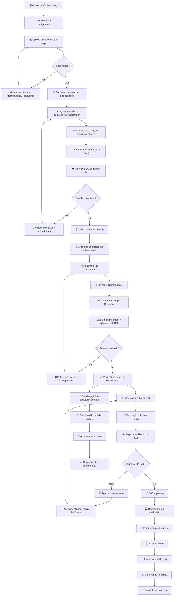

# 🧭 Parcours Utilisateur — PariSucre

> Documentation du parcours complet de l'utilisateur sur la plateforme PariSucre, de l'arrivée sur la homepage jusqu'à la réception de sa commande.

---

## Vue d'ensemble

Le parcours est conçu pour être **linéaire et sans friction** : le client accomplit l'ensemble de la commande en une seule session, sans créer de compte au préalable. L'expérience est pensée comme un **tunnel de conversion fluide en scroll vertical** sur une page unique.

---

## Diagramme de flux



---

## Étapes détaillées

### Étape 1 — Arrivée sur la homepage

| Élément | Description |
|---|---|
| **Section Hero** | Proposition de valeur claire : « Personnalisez vos bûchettes de sucre à l'image de votre établissement » |
| **Visuels** | Photos haute qualité de bûchettes personnalisées dans un contexte CHR (table de restaurant, comptoir de café) |
| **CTA principal** | Bouton « Créer mes bûchettes » ancré vers le configurateur |
| **Réassurance** | Badges : livraison gratuite IDF, paiement sécurisé, qualité premium |

> [!TIP]
> La page est conçue en **one-page** : toutes les étapes sont accessibles par simple scroll, sans navigation entre des pages différentes. Le configurateur est intégré directement dans la homepage.

---

### Étape 2 — Accès au configurateur

Le client scrolle ou clique sur le CTA pour atteindre la section **configurateur**. Le configurateur se compose de **6 sous-étapes** visuellement distinctes, dans un flux vertical continu :

1. Upload du logo
2. Palette de couleurs
3. Textes et mentions
4. Choix du template
5. Quantité et pricing
6. Résumé et validation

Une **barre de progression** indique l'avancement du client dans le tunnel.

---

### Étape 3 — Upload du logo

| Action | Détail |
|---|---|
| **Drag & drop** | Zone de dépôt de fichier avec icône et texte d'invitation |
| **Clic classique** | Bouton « Parcourir » en alternative au drag & drop |
| **Formats** | SVG, PDF, PNG, JPG, WEBP |
| **Taille max** | 10 Mo |
| **Feedback visuel** | Aperçu miniature du logo uploadé |
| **Validation** | Vérification immédiate du format, de la taille et de la résolution |

**Messages d'erreur possibles** :

| Situation | Message |
|---|---|
| Format non supporté | « Ce format de fichier n'est pas accepté. Formats supportés : SVG, PDF, PNG, JPG, WEBP. » |
| Fichier trop volumineux | « Le fichier dépasse la taille maximale de 10 Mo. Veuillez le compresser ou utiliser un autre format. » |
| Résolution < 150×150 px | « La résolution de votre image est trop faible (minimum 150×150 px). Veuillez utiliser une image de meilleure qualité. » |
| Résolution < 300×300 px | ⚠️ « La résolution de votre image est faible. Le rendu final pourrait être pixelisé. Nous recommandons une résolution d'au moins 300×300 px. » *(non bloquant)* |

---

### Étape 4 — Extraction et ajustement des couleurs

| Action | Détail |
|---|---|
| **Extraction automatique** | L'algorithme analyse le logo et extrait les 6 couleurs dominantes |
| **Affichage palette** | Les couleurs sont présentées sous forme de cercles cliquables |
| **Modification** | Chaque couleur est modifiable via un **ColorPicker** intégré |
| **Réinitialisation** | Bouton « Réinitialiser » pour revenir aux couleurs extraites |
| **Preview instantanée** | Le template se met à jour en temps réel à chaque changement de couleur |

> [!NOTE]
> L'extraction se fait **côté client** via la Canvas API et la librairie node-vibrant. Aucune donnée n'est envoyée au serveur à cette étape.

---

### Étape 5 — Saisie des informations textuelles

| Champ | Obligatoire | Contrainte | Exemple |
|---|---|---|---|
| **Nom de l'établissement** | ✅ Oui | 50 caractères max | « Café de Flore » |
| **Slogan** | ❌ Non | 80 caractères max | « Depuis 1887 » |
| **Adresse légale** | ❌ Non | 150 caractères max | « 172 Bd Saint-Germain, 75006 Paris » |

- Si l'adresse légale n'est pas renseignée, l'adresse PariSucre par défaut sera utilisée sur la bûchette.
- Un compteur de caractères est affiché pour chaque champ.
- Le preview SVG se met à jour en temps réel lors de la saisie.

---

### Étape 6 — Sélection du template

Le client choisit parmi **4 templates** de bûchettes :

| Template | Style | Ton |
|---|---|---|
| 🎨 **Classique** | Dégradé horizontal, logo à gauche | Polyvalent, intemporel |
| ✨ **Élégant** | Fond uni sombre, filet doré, serif | Haut de gamme, raffiné |
| ⚡ **Moderne** | Fond blanc, couleurs vives, sans serif | Contemporain, épuré |
| 🏠 **Bistrot** | Textures rétro, typographie vintage | Authentique, chaleureux |

**Interaction** :
- Les 4 templates sont affichés côte à côte (desktop) ou en carrousel (mobile)
- Chaque template est prérendu avec le logo et les couleurs du client
- Un clic sélectionne le template → la preview principale se met à jour
- Le template sélectionné est mis en surbrillance avec une bordure colorée

---

### Étape 7 — Sélection de la quantité et pricing

| Élément | Description |
|---|---|
| **Sélecteur** | Boutons prédéfinis (1 000, 2 500, 5 000, 10 000) + champ personnalisé |
| **Prix dégressif** | Tableau des paliers avec prix unitaire HT, prix total, et économie en pourcentage |
| **Mise en avant** | Le palier actuel est surligné. L'économie par rapport au palier 1 est affichée en vert |
| **Badge promo** | « Meilleur rapport qualité-prix » sur le palier le plus populaire |
| **Conditionnement** | Indication du nombre de cartons (500 ou 1 000 bûchettes/carton) |

**Exemple d'affichage** :

```
┌──────────────────────────────────────────────────────┐
│  📦 1 000 bûchettes    │  0,12 €/u  │  120,00 € HT │
├──────────────────────────────────────────────────────┤
│  📦 2 500 bûchettes    │  0,10 €/u  │  250,00 € HT │  -17 %
├──────────────────────────────────────────────────────┤
│  📦 5 000 bûchettes ⭐ │  0,08 €/u  │  400,00 € HT │  -33 %
├──────────────────────────────────────────────────────┤
│  📦 10 000 bûchettes   │  0,06 €/u  │  600,00 € HT │  -50 %
└──────────────────────────────────────────────────────┘
```

---

### Étape 8 — Résumé de la commande

Avant de procéder au paiement, le client voit un **récapitulatif complet** :

| Ligne | Exemple |
|---|---|
| Aperçu du template | Preview SVG réduite |
| Template sélectionné | Classique |
| Quantité | 5 000 bûchettes (10 cartons de 500) |
| Prix unitaire HT | 0,08 € |
| Sous-total HT | 400,00 € |
| Livraison | Gratuite (Île-de-France) |
| TVA (20 %) | 80,00 € |
| **Total TTC** | **480,00 €** |

Bouton **« Commander et payer »** en bas du résumé.

---

### Étape 9 — Paiement Stripe

| Élément | Description |
|---|---|
| **Redirection** | Le client est redirigé vers la page Stripe Checkout hébergée |
| **Mode** | Guest checkout — pas de compte requis |
| **Informations collectées** | Email, nom, adresse de facturation, adresse de livraison, SIRET (optionnel) |
| **Moyens de paiement** | Carte bancaire (Visa, Mastercard, CB) |
| **Sécurité** | Page Stripe certifiée PCI-DSS Niveau 1 |
| **Annulation** | Bouton « Retour » ramène au configurateur (état préservé via localStorage) |

---

### Étape 10 — Confirmation de commande

Après paiement réussi, le client est redirigé vers une **page de confirmation** :

| Élément | Description |
|---|---|
| **Titre** | « ✅ Votre commande est confirmée ! » |
| **Numéro de commande** | Affiché en gros + copié dans le presse-papier |
| **Résumé** | Rappel du contenu de la commande |
| **Prochaine étape** | « Vous allez recevoir un email avec votre bon à tirer (BAT) à valider. » |
| **Lien** | « Créer mon compte pour suivre mes commandes » |

---

### Étape 11 — Réception des emails

Le client reçoit **deux emails** après le paiement :

#### Email 1 — Confirmation de commande

- Objet : « Commande #XXXX confirmée — PariSucre »
- Contenu : récapitulatif complet, montants, adresses, numéro de commande
- CTA : « Voir ma commande »

#### Email 2 — BAT à valider

- Objet : « Votre bon à tirer est prêt — Action requise »
- Contenu : aperçu du BAT (image) + description
- CTA : « Valider mon BAT » → magic link vers la page de validation
- Note : « Si le rendu ne vous convient pas, vous pourrez demander des ajustements. »

---

### Étape 12 — Validation du BAT

Le client clique sur le **magic link** dans l'email et accède à la page de validation :

| Élément | Description |
|---|---|
| **Aperçu BAT** | Image haute qualité du BAT (recto et verso de la bûchette) |
| **Zoom** | Possibilité de zoomer sur les détails |
| **Bouton « Approuver »** | Valide le BAT → lancement de la production |
| **Bouton « Demander des modifications »** | Ouvre un champ commentaire pour préciser les changements souhaités |
| **Délai** | « Veuillez valider sous 48h pour ne pas retarder votre commande » |

---

### Étape 13 — Production

- Le client reçoit un email de confirmation lorsque la commande passe en production.
- Délai indicatif communiqué : « Votre commande sera expédiée sous 5 à 10 jours ouvrés. »

---

### Étape 14 — Activation du compte

En parallèle du processus de commande, le client reçoit un email d'activation :

| Élément | Description |
|---|---|
| **Objet** | « Créez votre espace client PariSucre » |
| **Contenu** | Magic link pour définir un mot de passe |
| **Fonctionnalités** | Accès à l'historique des commandes, re-commande simplifiée, gestion du profil |
| **Non bloquant** | L'activation du compte est optionnelle et indépendante du processus de commande |

---

### Étape 15 — Expédition

- Admin met à jour le statut avec le numéro de suivi du transporteur.
- Le client reçoit un email :
  - Objet : « Votre commande a été expédiée ! »
  - Contenu : numéro de suivi cliquable (lien vers le site du transporteur)
  - Délai estimé de livraison

---

### Étape 16 — Commande terminée

- La commande passe au statut `COMPLETED`.
- Le client reçoit un email de remerciement :
  - Objet : « Vos bûchettes sont arrivées ! »
  - CTA : « Commander à nouveau » (lien vers le configurateur pré-rempli avec le même logo)
  - Demande d'avis / feedback

---

## Tableau récapitulatif des étapes

| # | Étape | Page | Email | Statut commande |
|---|---|---|---|---|
| 1 | Arrivée homepage | Homepage | — | — |
| 2 | Configurateur | Homepage | — | — |
| 3 | Upload logo | Homepage | — | — |
| 4 | Couleurs | Homepage | — | — |
| 5 | Textes | Homepage | — | — |
| 6 | Template | Homepage | — | — |
| 7 | Quantité + prix | Homepage | — | — |
| 8 | Résumé | Homepage | — | — |
| 9 | Paiement | Stripe Checkout | — | `PENDING_PAYMENT` |
| 10 | Confirmation | /commande/confirmation | ✅ Confirmation | `PAID` |
| 11 | Emails reçus | — | ✅ BAT | `WAITING_APPROVAL` |
| 12 | Validation BAT | /bat/[token] | — | `APPROVED` |
| 13 | Production | — | ✅ Production | `IN_PRODUCTION` |
| 14 | Activation compte | /compte/activer/[token] | ✅ Magic link | — |
| 15 | Expédition | — | ✅ Tracking | `SHIPPED` |
| 16 | Terminée | — | ✅ Satisfaction | `COMPLETED` |
